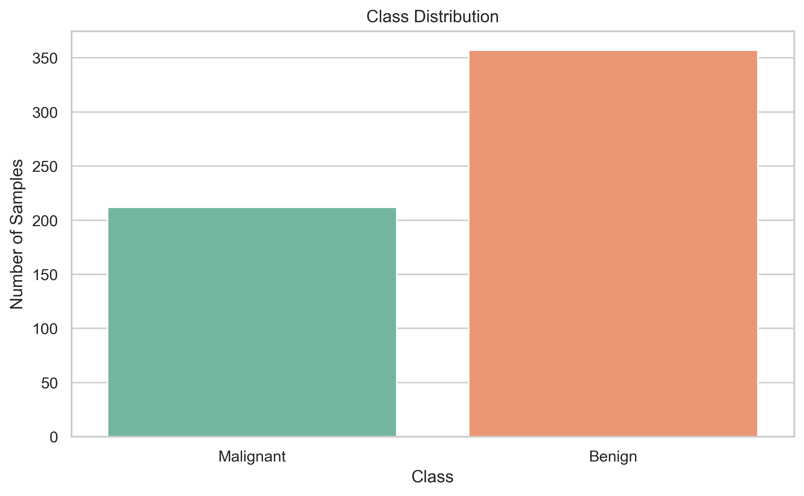
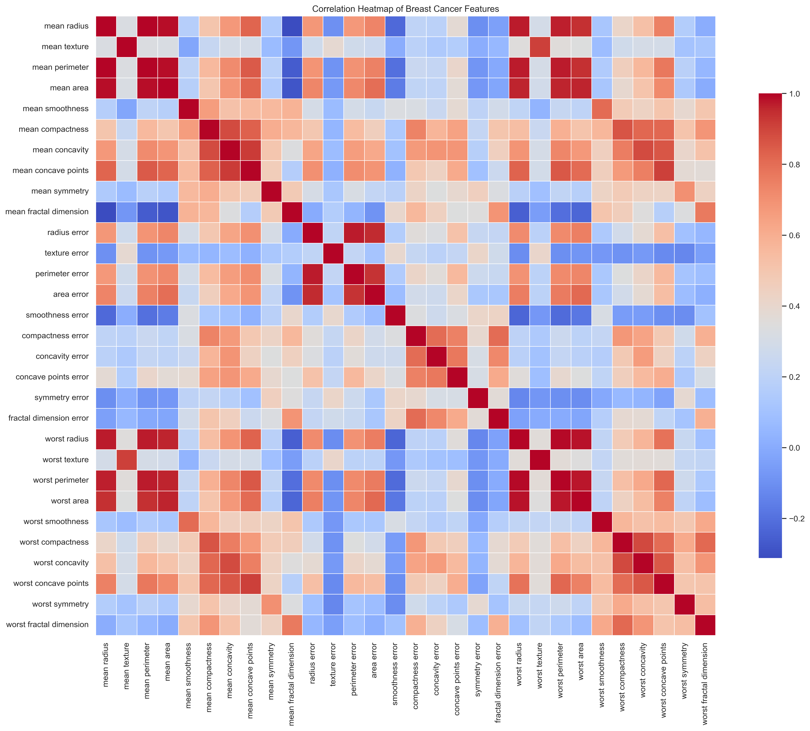
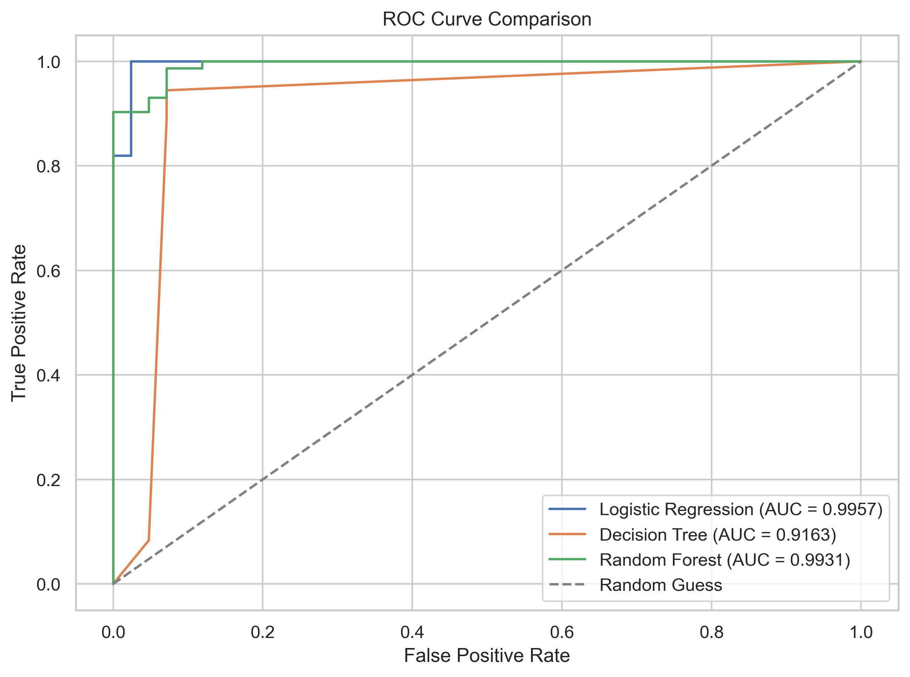

# Disease Prediction from Medical Data

This beginner-friendly machine learning project predicts whether a patient has breast cancer using the Breast Cancer dataset available in Scikit-Learn. It is designed to look like an internship-level submission and a clean GitHub portfolio project.

## Objective

Build and compare multiple classification models to predict whether a tumor is:

- `Malignant` (cancerous)
- `Benign` (non-cancerous)

The project includes:

- Exploratory Data Analysis (EDA)
- Data preprocessing
- Model training and comparison
- Evaluation with multiple metrics
- Confusion matrix and ROC curve visualization
- Model saving with `joblib`
- A standalone prediction script
- A Jupyter notebook version of the full workflow

## Tech Stack

- Python
- Pandas
- NumPy
- Matplotlib
- Seaborn
- Scikit-Learn
- Joblib

## Dataset

The project uses the built-in **Breast Cancer Wisconsin Diagnostic Dataset** from `sklearn.datasets`.

- Total samples: `569`
- Total features: `30`
- Target classes:
  - `0 = Malignant`
  - `1 = Benign`

## Project Structure

```text
Disease-Prediction/
│
├── data/
│   ├── best_model_metrics.csv
│   ├── model_comparison.csv
│   └── test_data.csv
├── notebooks/
│   └── Disease_Prediction.ipynb
├── src/
│   ├── train.py
│   ├── evaluate.py
│   └── predict.py
├── models/
│   ├── best_model.pkl
│   └── model_metadata.pkl
├── screenshots/
│   ├── class_distribution.png
│   ├── confusion_matrix_best_model.png
│   ├── correlation_heatmap.png
│   ├── model_performance_comparison.png
│   ├── roc_curve_comparison.png
│   ├── saved_model_confusion_matrix.png
│   └── saved_model_roc_curve.png
├── PROJECT_REPORT.md
├── README.md
└── requirements.txt
```

## Machine Learning Workflow

1. Load the Breast Cancer dataset from Scikit-Learn.
2. Convert the dataset into a Pandas DataFrame.
3. Perform EDA:
   - Dataset shape
   - Feature names
   - Class distribution
   - Missing value analysis
   - Correlation heatmap
4. Split the data into training and testing sets.
5. Train three models:
   - Logistic Regression
   - Decision Tree
   - Random Forest
6. Compare model performance using:
   - Accuracy
   - Precision
   - Recall
   - F1 Score
   - ROC-AUC Score
7. Select the best model based on ROC-AUC.
8. Save the best model using `joblib`.
9. Predict class labels for new sample input.

## Model Performance

The following results were generated with an 80-20 train-test split and `random_state=42`.

| Model | Accuracy | Precision | Recall | F1 Score | ROC-AUC |
|------|------:|------:|------:|------:|------:|
| Logistic Regression | 0.9825 | 0.9861 | 0.9861 | 0.9861 | 0.9957 |
| Random Forest | 0.9561 | 0.9589 | 0.9722 | 0.9655 | 0.9931 |
| Decision Tree | 0.9211 | 0.9565 | 0.9167 | 0.9362 | 0.9163 |

## Best Model

**Logistic Regression** was selected as the best model because it achieved the highest ROC-AUC score while also delivering the best overall accuracy on the test set.

- Best model: `Logistic Regression`
- Accuracy: `0.9825`
- Precision: `0.9861`
- Recall: `0.9861`
- F1 Score: `0.9861`
- ROC-AUC: `0.9957`

## Visual Outputs

### Class Distribution



### Correlation Heatmap



### ROC Curve Comparison



## How to Run

### 1. Clone the repository

```bash
git clone <your-repository-url>
cd Disease-Prediction
```

### 2. Install dependencies

```bash
pip install -r requirements.txt
```

### 3. Train the models

```bash
python src/train.py
```

This script will:

- perform EDA
- train all three models
- compare performance
- save the best model in `models/best_model.pkl`
- save test data and charts

### 4. Evaluate the saved model

```bash
python src/evaluate.py
```

This script will:

- load the saved best model
- evaluate it on the stored test data
- generate a confusion matrix
- generate a ROC curve

### 5. Run a prediction

Use the default sample:

```bash
python src/predict.py
```

Use another dataset sample:

```bash
python src/predict.py --sample-index 25
```

Use your own 30 feature values:

```bash
python src/predict.py --values "17.99,10.38,122.8,1001.0,0.1184,0.2776,0.3001,0.1471,0.2419,0.07871,1.095,0.9053,8.589,153.4,0.006399,0.04904,0.05373,0.01587,0.03003,0.006193,25.38,17.33,184.6,2019.0,0.1622,0.6656,0.7119,0.2654,0.4601,0.1189"
```

## Files Description

- `src/train.py`: loads data, performs EDA, trains and compares models, and saves the best one.
- `src/evaluate.py`: loads the saved model and evaluates it on the test set.
- `src/predict.py`: loads the saved model and predicts for sample input.
- `notebooks/Disease_Prediction.ipynb`: notebook version of the full project.
- `PROJECT_REPORT.md`: short internship-style report.

## Why This Project Is Good for Beginners

- Uses a real medical dataset from Scikit-Learn.
- Covers the complete machine learning workflow.
- Uses clear comments and simple code structure.
- Demonstrates both scripts and notebook-based development.
- Produces saved artifacts that make the project easy to present on GitHub.

## Future Improvements

- Perform hyperparameter tuning with `GridSearchCV`.
- Add cross-validation for more robust evaluation.
- Build a simple web app using Streamlit or Flask.
- Add feature importance interpretation with SHAP or permutation importance.

## Author Note

This project is intentionally written in a simple and readable style so it can be understood easily by students, beginners, and internship reviewers.
